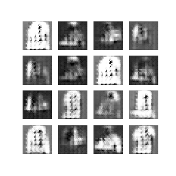

# Generative Adverserial Networks

Generative adverserial networks have two parts, the generator which produces fake data points and the discriminator (adversary) which predicts whether a given image is fake or real. The two networks are trained together providing feedback to each other and minimizing both the generator loss and discriminator loss. This is different from the static loss landscape of regular classifiers. 

In this notebook, MNIST Fashion data set is used as input data to generate realistic fake fashion images using TensorFlow and Keras.

As the training progresses, we see the fake images generated by the network becomes more and more realistic as shown below:

